<!-- palette: everforest dark · bg #2d353b · fg #d3c6aa · green #a7c080 · aqua #83c092 · yellow #dbbc7f · orange #e69875 · red #e67e80 · purple #d699b6 · blue #7fbbb3 -->

<p align="center">
  
</p>

<p align="center">
  <a href="https://www.linkedin.com/in/igor-pinheiro-4872491b6/"></a>
  <a href="mailto:pinheiroigor@proton.me"></a>
</p>

<br />


```ts
const igor = {
  role:       "backend / fullstack developer (mid-level)",
  location:   "bauru, sp — brazil 🇧🇷",
  experience: "3y building software · 4y+ in tech",
  now:        "lead dev of a multi-tenant whatsapp crm @ lëëk tecnologia",
  focus:      ["node.js", "typescript", "nestjs", "postgresql"],
  enjoys:     ["queues & async jobs", "code review", "root-cause hunting"],
  values:     "organized code that's easy to maintain",
  languages:  ["português (native)", "english (professional)"],
  funFact:    "playing tibia since 2012 — still not level 200 🐉",
};
```

<br />

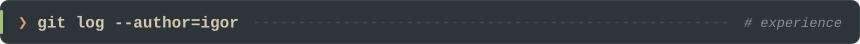

> **fullstack developer** · *lëëk tecnologia* · `mar 2026 → now`
>
> building the company's new product almost solo: a **multi-tenant whatsapp crm** for telemarketing ops —
> nestjs + postgres backend, async processing with **bullmq/redis**, a **browser extension** for operators on whatsapp web,
> and a **manager dashboard** with audits & metrics. all dockerized. also reviewing the team's code.

> **fullstack developer** · *ikatec* · `oct 2024 → mar 2026`
>
> delivery squad on the main platform — features from design to validation, helped build the
> **automatic self-signup** flow, and kept production healthy handling bugs & incidents.

> **it coordinator** · *aelesab* · `sep 2023 → may 2024`
>
> built the in-house **erp** in a two-person team, used by **100+ employees**, and led it infrastructure.

<br />

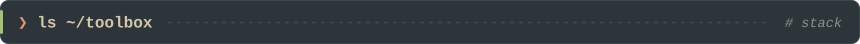

<p>
  
  
  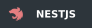
  
  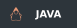
  
</p>
<p>
  
  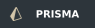
  
  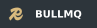
  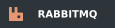
</p>
<p>
  
  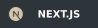
  
</p>
<p>
  
  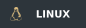
  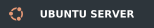
  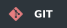
  
</p>

<sub><code>// currently learning: java & spring boot</code></sub>

<br /><br />

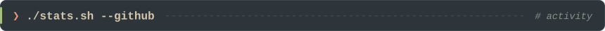

<p align="center">
  
  
</p>

<p align="center">
  
</p>

<p align="center">
  
</p>

<br />

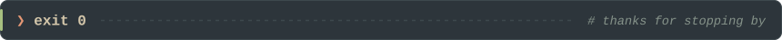
